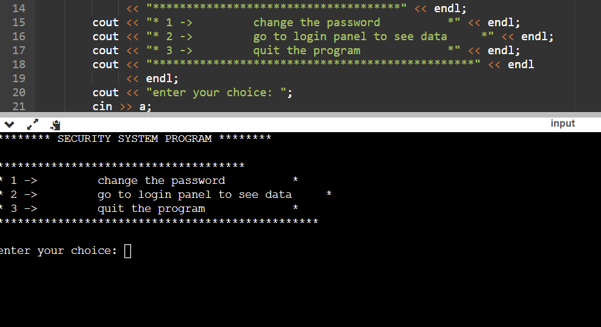
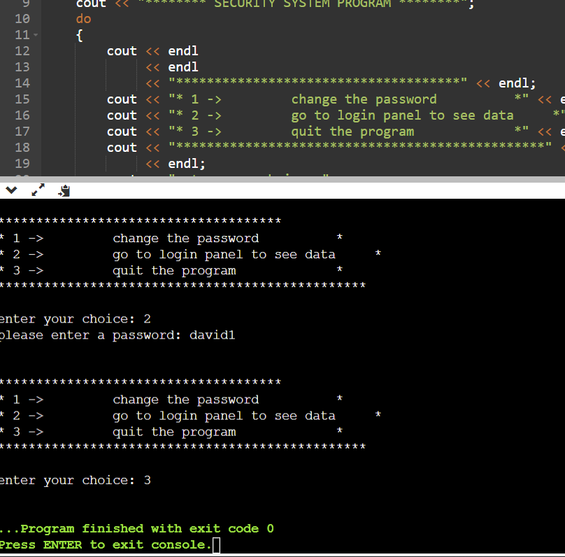

# Security-Systems-in-C++

# Title: Security System 

## Coding Language: 
This is a Security System project where I built using C++

## Purpose: 
To understand C++ syntax and to create a project that can handle password change and login information. 

## How to install:
1. Download from the zip: ``
2. Cd to folder named: ``
3. Make sure you have 
4. You can run the code on VS code.
5. Or use a online compiler.

## Output Screenshots:

